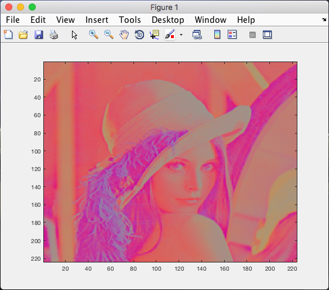
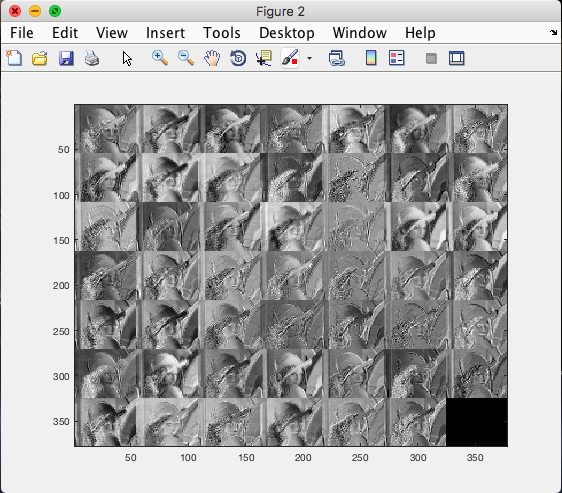

# Matlab Implementation

## **convlayer.m**
Convolutional Layer modelled in Matlab. This script was used to test sanity of the first convolutional layer.

*Requires VLFeat and MatConvNet to be installed:*

	1) https://github.com/vlfeat/vlfeat/tree/master
	2) https://github.com/vlfeat/matconvnet

## **code 1, 2 and 3**

Models the first convolutional layer as described in the paper. It takes any equidimensional image, normalizes, and resizes it to 224x224 px.

It then intialises a random filter bank of kernel size KxK in M dimesnions, one for each output feature map.

Finally, it perfroms the convolution of the input feature maps with weights given to generate a RxC output feature map in each M dimension.

In Code 2 and 3, Tiling and local memory caching is introduced.

*Requires VLFeat  to be installed to run vl_imarraysc, Figure 2 has been commented out in each code for systems without VLFeat*

Matlab function *profile* is used to time each implementation, and a DRAM counter counts the number of DRAM accesses. 

### **Code 1**

Execution Time:	10.692 s

DRAM Accesses: 	203,233,536

### **Code 2**

Execution Time:	14.343 s

DRAM Accesses: 	784

### **Code 3**

Execution Time:	16.057 s

DRAM Accesses: 	784

## **Conclusions**

Tiling and buffering data between the processing element's SRAM and DRAM increases unessecarry DRAM accesses.

We would expect to see a reduction in time, however SRAM implementation in Matlab could not be modeled. Code 3 and 2 have similar results as pipelining and unrolling cannot be simply achieved in Matlab.

Unrolling the processing element loop by manually duplicating computations resulted in higher times than using a for loop. I suspect this to be because Matlab optimizes schedulaing for for loops vs line by line arithmetic. 

### Other files ###
**imtile.m** : Is a function that visualizes the sliding window of an image. This was written with hopes of emulating SRAM for the loaded image pixels.

**imnorm.m** : Is a function that normalizes a RGB image.

**imtile_tb.m** : Testbench for imtile.m
